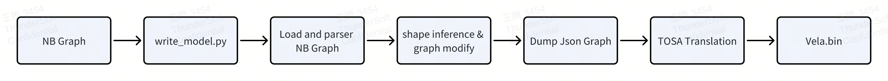
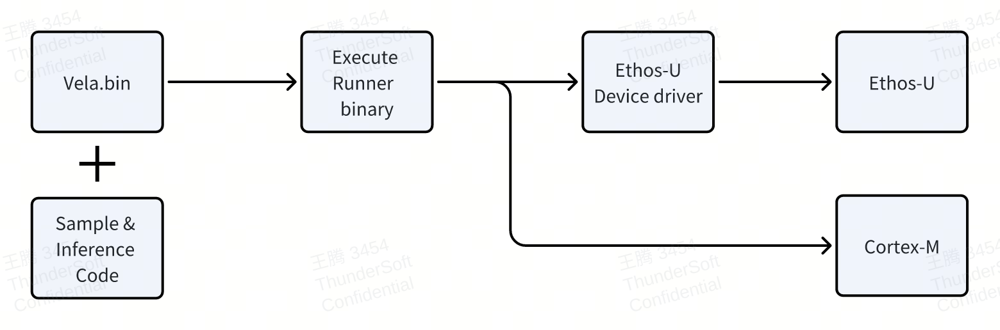

# Arm-Paddlelite Configuration and Instructions

## Environment Configuration

1. Environment

| System | Ubuntu x86 20.04/22.04 |
| ------ | ---------------------- |
| cmake  | 3.21                   |
| python | 3.9                    |

2. Python Configuraion

a. Download `Anaconda`, URL: https://www.anaconda.com/download/success  
b. After downloading, run the installation script and follow the prompts to install

```bash
bash Anaconda3-2022.10-Linux-x86_64.sh
```

3. Create Python Virtual Environment

```bash
# Create a virtual environment named paddle_arm with Python 3.9
conda create -n paddle_arm python==3.9 -y
# Activate the created virtual environment
conda activate paddle_arm

# Check if successfully activated
which python
# If /home/YOURNAME/anaconda3/envs/paddle_arm/bin/python is displayed, you are in the paddle_arm virtual environment
```

4. Configure Environment

```bash
cd arm-paddle/Paddle-Lite-Ethos
./install.sh
```
  * `install.sh` configuration description

    ```bash
    # Configure ethos-u-scratch的toolchain
    source lite/backends/arm/ethos-u-scratch/setup_path.sh

    # Compile libpaddle_api_light_bundled.a
    RUN_SH_PATH=lite/backends/arm/run.sh
    ./$RUN_SH_PATH

    # Install TOSA Serialization Library.
    pushd readnb/serialization_lib
    pip install -e .
    popd

    # Install python environment dependencies
    pip install -r readnb/requirements.txt
    ```

# Process Description
## Conversion Process
- Read Paddle-lite NB graph, parse and convert to TOSA graph, then generate Vela binary


## Execution Process
- Generated Vela Binary + runtime C code, generate runtime binary, import to target device (FVP-corstone320) for execution


# Code Description
## Structure

```bash
├── cmake
├── docs
├── install.sh    # Environment configuration script
├── lite          # Paddle-lite framework from Baidu
│   ├── backends  # ethos backend configured under backends/arm
│   ...
├── model_zoo         # Demo zoo
├── paddle_verify.sh  # Demo execution script
├── readnb            #  Parser library, includes NB reading and NB conversion
│   ├── paddle             # paddle model format
│   ├── parser             # parser implementation
│   ├── read_model.py      # NB model loading inferfaces
│   ├── serialization_lib  # TOSA serialization library
│   └── write_model.py     # model parser interfaces
├── third-party # Third Party libraries.
├── tools   # Function code exported from PaddleLite
└── verify  # paddle_verify output path
```

## Main Function Descriptions

1. read_model.py

Read the model structure, supports `Paddle-Lite`/`TOSA` structure reading.

Usage:

```bash
cd readnb
python read_model.py ../model_zoo/PPLCNetV2_infer_int8/PPLCNetV2_base_infer_int8_opt.nb
```

2. write_model.py

Parse Paddle-Lite NB model structure and convert to vela file.

Usage:

```bash
cd readnb
python write_model.py
--model_path ../model_zoo/MobileNetV1_infer_int8/mobilenetv1_int8_opt.nb
--out_dir ../model_zoo/MobileNetV1_infer_int8/
--remove_op_id 32
```

| Params         | Description                                                    |
| -------------- | -------------------------------------------------------------- |
| --model_path   | support nb model and model graph.json create by write_model.py |
| --out_dir      | output path                                                    |
| --remove_op_id | Remove Op of id and last, default is not remove                |
| --input        | input tensor infer [NAME SHAPE] e.g. input 1,3,224,224         |
| --dump_graph   | dump Puml file for json graph"                                 |


3. paddle_verify.sh

Inference scripts for algorithms under model_zoo, see `"Inference Execution"` section for usage.

# Inference Execution
1. Make sure you are in the `paddle_arm` virtual environment

```bash
# Check if successfully activated
which python
# If /home/YOURNAME/anaconda3/envs/paddle_arm/bin/python is displayed, you are in the paddle_arm virtual environment

# If /usr/bin/python is displayed, you are NOT in the paddle_arm virtual environment
# You need to activate the paddle_arm virtual environment
conda activate paddle_arm
```

2. Run script paddle_verify.sh

```powershell
Usage ./paddle_verify.sh [options] [arguments]
Options:
  -h, --help            Show this help message and exit.
  -m, --model <name>    Specify the model type.
  -p, --pic <file>      Specify the path to the image.
  -c, --confidence <score>    Specify the threshold of confidences.
Model types:
  mv1                   MobileNetV1
  pplcnetv2             PP_LCNetV2
  tinypose              PP_TinyPose
  picodetv2             PICODetV2
  blazeface             BlazeFace
  ppocr_det             PP_OCR_det
  humansegv2            Humansegv2
  ppocr_rec             PP_OCR_rec
  ppocr_layout          PP_OCR_layout
Example:
  ./paddle_verify.sh --model=mv1 --pic=./data/1.jpg
```
    --model ： select the model to run
    --pic ：   select the image for inference
    --confidence：confidence score (effective for detection algorithms [BlazeFace/PPTinyPose/PicoDetV2/PPOcr_Det/PPOcr_Layout])

- mv1:
```powershell
./paddle_verify.sh --model=mv1 --pic=model_zoo/MobileNetV1_infer_int8/ILSVRC2012_val_00000178.JPEG

# After execution, displays:
Build finished
Running postprocess steps for MobileNetV1...
Top 5 Classification Results:
Rank 1: husky (Probability: 0.9907)
Rank 2: Siberian Husky (Probability: 0.0067)
Rank 3: Norwegian Elkhound (Probability: 0.0025)
Rank 4: Alaskan Malamute (Probability: 0.0001)
Rank 5: German Shepherd Dog (Probability: 0.0000)
```

- pplcnetv2：
```powershell
./paddle_verify.sh --model=pplcnetv2 --pic=model_zoo/PPLCNetV2_infer_int8/ILSVRC2012_val_00000994.JPEG 

# After execution, displays:
Build finished
Running postprocess steps for PP-LCNetV2...
Top 5 Classification Results:
Rank 1: goldfish (Probability: 0.9060)
Rank 2: clownfish (Probability: 0.0037)
Rank 3: rock beauty (Probability: 0.0022)
Rank 4: macaw (Probability: 0.0019)
Rank 5: lorikeet (Probability: 0.0011)
```

- picodetv2：
```powershell
./paddle_verify.sh --model=picodetv2 --pic=model_zoo/PicoDetV2_infer_int8/demo.jpg

# After execution, displays:
Total boxes before NMS: 20
Total boxes after NMS: 4
detection, image size: 768, 576, detect object: bicycle, score: 0.5256, location: x=175, y=147, width=406, height=285
detection, image size: 768, 576, detect object: car, score: 0.7315, location: x=450, y=56, width=215, height=130
detection, image size: 768, 576, detect object: dog, score: 0.6302, location: x=85, y=189, width=337, height=312
Results saved to: model_zoo/PicoDetV2_infer_int8/demo_detection_result.jpg
```

- Blazeface:
```powershell

./paddle_verify.sh --model=blazeface --pic=model_zoo/BlazeFace_infer_int8/000000423506.jpg
# After execution, displays:
Build finished
Running postprocess steps for BlazeFace...
Confidence Threshold is Defult [0.65]
1x16x16x32 -96 127
1x16x16x2 -114 0
1x8x8x6 -78 6
1x8x8x96 -72 127
Saved output_1.bin
Saved  output_0.bin
Output - boxes: (1, 896, 16), scores: (1, 896, 1)
Load success: ./model_zoo/BlazeFace_infer_int8/anchorsback.npy
Success load image: model_zoo/BlazeFace_infer_int8/000000423506.jpg, shape: (500, 375, 3)

===== Model output  =====
raw_boxes shape: (1, 896, 16)
raw_scores shape: (1, 896, 1)
raw_boxes range: -71.0860824584961 to 125.38795471191406
raw_scores range: -399.47918701171875 to 1.8431675434112549
sigmoid score range: 0.0 to 0.8633228540420532
Score >= 0.1 Number: 133
Score >= 0.3 Number: 81
Score >= 0.5 Number: 52
Score >= 0.65 Number: 9
Score >= 0.8 Number: 4
Score >= 0.9 Number: 0
=========================

Detect  2 faces
Found 2 faces
Result saved to : ./model_zoo/BlazeFace_infer_int8/detection_result.jpg
```
- PPOCR_det:
```powershell
./paddle_verify.sh --model=ppocr_det --pic=model_zoo/PpocrDet_infer_int8/test.jpg

# After execution, displays:
Build finished
Running postprocess steps for Ppocr_det...
Confidence Threshold is Defult [0.6]
Results saved to  ./model_zoo/PpocrDet_infer_int8/detresult.jpg
```

- HumanSegv2:
```powershell
./paddle_verify.sh --model=humansegv2 --pic=model_zoo/Human_pp_humansegv2_lite_avgmax_int8_opt/human.jpg

# After execution, displays:
Build finished
Running postprocess steps for Humanseg...
Result saved to: model_zoo/Human_pp_humansegv2_lite_avgmax_int8_opt/seg_output_human.jpg
```

- PPOCR-REC:
```powershell
./paddle_verify.sh --model=ppocr_rec --pic=model_zoo/PpocrRec_infer_int8/test.jpg

# After execution, displays:
Rec Reuslut: 纯臻营养护发素
Confidence: 0.966813
```

- PPOCR-Layout:
```powershell
./paddle_verify.sh --model=ppocr_layout --pic=model_zoo/Ppocr_layout_infer_int8/layout.jpg

# After execution, displays:
Build finished
Running postprocess steps for Ppocr_layout...
Confidence Threshold is Defult [0.42]
1x37x25x19 -116 22
1x37x100x76 -128 103
1x37x50x38 -111 114
1x37x13x10 -81 67
Saved  4xoutput_x.bin
Detection Class ID: 0, Confidence Level: 0.932397723197937
Detection Result - text, Confidence Level: 0.932, Position: x=315, y=678, Width=256, Height=111
Detection Class ID: 0, Confidence Level: 0.9078565239906311
Detection Result - text, Confidence Level: 0.908, Position: x=28, y=599, Width=262, Height=189
Detection Class ID: 0, Confidence Level: 0.8755950927734375
Detection Result - text, Confidence Level: 0.876, Position: x=311, y=457, Width=255, Height=190
Detection Class ID: 0, Confidence Level: 0.8755950927734375
Detection Result - text, Confidence Level: 0.876, Position: x=312, y=321, Width=262, Height=108
Detection Class ID: 0, Confidence Level: 0.8560096025466919
Detection Result - text, Confidence Level: 0.856, Position: x=313, y=17, Width=259, Height=57
Detection Class ID: 0, Confidence Level: 0.8341022729873657
Detection Result - text, Confidence Level: 0.834, Position: x=28, y=317, Width=262, Height=252
Detection Class ID: 0, Confidence Level: 0.8298503756523132
Detection Result - text, Confidence Level: 0.830, Position: x=29, y=18, Width=259, Height=57
Detection Class ID: 1, Confidence Level: 0.7087191343307495
Detection Result - title, Confidence Level: 0.709, Position: x=311, y=661, Width=107, Height=16
Detection Class ID: 1, Confidence Level: 0.4852926731109619
Detection Result - title, Confidence Level: 0.485, Position: x=28, y=579, Width=116, Height=18
Detection Class ID: 1, Confidence Level: 0.4518944025039673
Detection Result - title, Confidence Level: 0.452, Position: x=313, y=441, Width=222, Height=16
Detection Class ID: 4, Confidence Level: 0.4490630030632019
Detection Result - table, Confidence Level: 0.449, Position: x=346, y=99, Width=191, Height=195
Detect 11 targets
Result Image saved into : model_zoo/Ppocr_layout_infer_int8/layout_object_detection_result.jpg

```

- PP_TinyPose:
```powershell
./paddle_verify.sh -m tinypose -p ./model_zoo/PP_TinyPose_128x96_qat_dis_nopact_opt/posedet_demo.jpg 

# After execution, displays:
build finished
Running postprocess steps for PP-TinyPose...
Confidence Threshold is Defult [0.001]
Processing image: ./model_zoo/PP_TinyPose_128x96_qat_dis_nopact_opt/posedet_demo.jpg
results: 17
[0] - 62.02461293029884, 39.74860931665951
[1] - 49.391587756639275, 48.609370527819536
[2] - 55.98908778879232, 34.780377853585925
[3] - 50.521644157889455, 72.84972269936728
[4] - 59.87354282923517, 27.064136962226545
[5] - 92.83842450579414, 119.98358895705523
[6] - 104.21025931657965, 39.41282778235758
[7] - 117.71511078741003, 178.4200518261507
[8] - 161.70193535131398, 48.038728189110685
[9] - 150.00699405816826, 146.30163823453938
[10] - 200.51643733068647, 42.10881642940822
[11] - 193.17997641430844, 154.76030844294786
[12] - 211.6208671562372, 116.69873313332644
[13] - 273.16607567545225, 222.45633709305233
[14] - 291.04699382423377, 154.48346355286114
[15] - 338.2199269272363, 269.56945219973323
[16] - 265.848066336783, 165.96407259602475
Annotated image saved to: ./model_zoo/PP_TinyPose_128x96_qat_dis_nopact_opt/output.jpg

```
