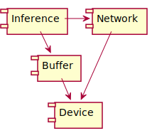
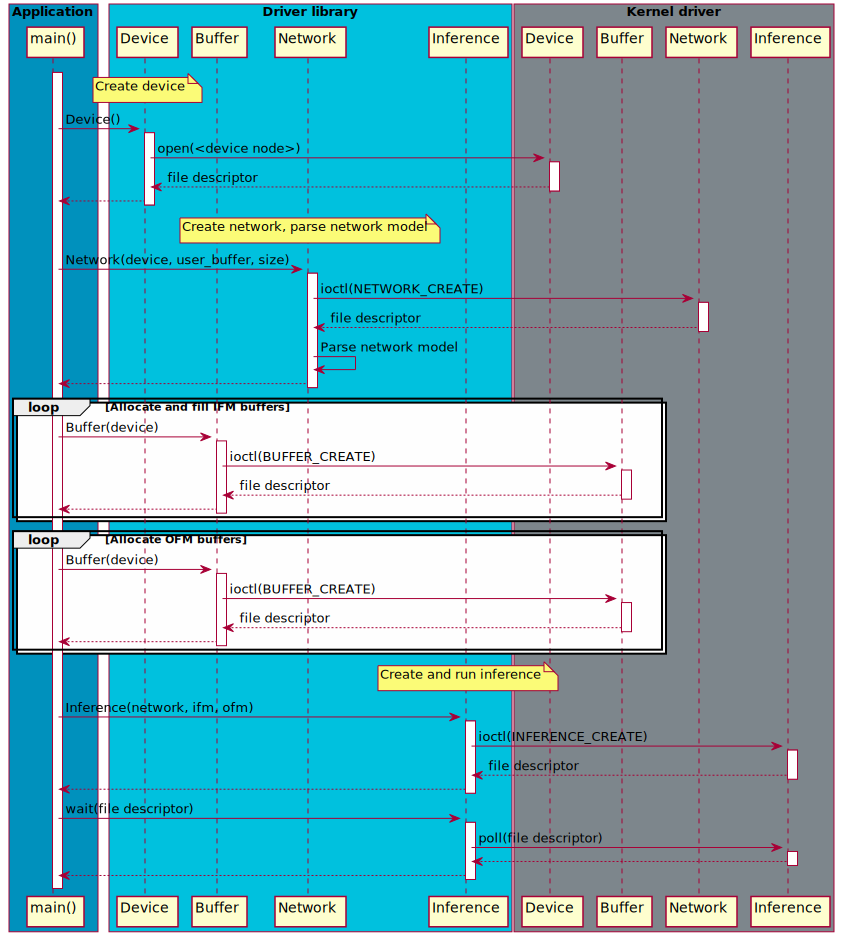
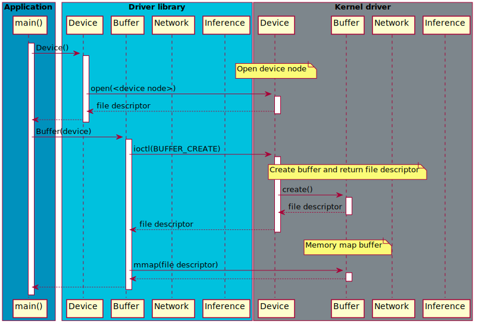
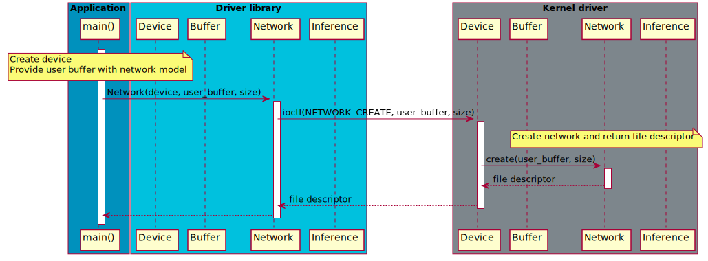
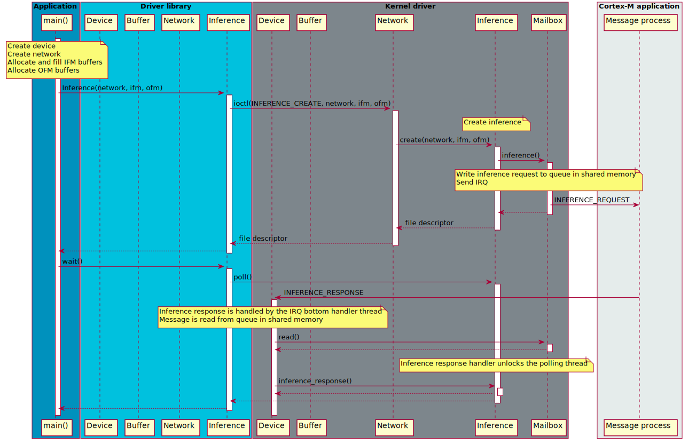

# Linux driver stack for Arm(R) Ethos(TM)-U

The Linux driver stack for Arm(R) Ethos(TM)-U demonstrates how to setup a
Asymmetric MultiProcessing (AMP) system, dispatching inferences to an Ethos-U
subsystem consisting of an Arm Cortex(R)-M and one or multiple Ethos-U NPUs.

The communication between Linux and the firmware is based on the Linux APIs
remoteproc, rpmsg, virtio, reset and mailbox. These APIs are implemented on the
firmware side by the OpenAMP framework.

# Building

The driver stack comes with a CMake based build system. A toolchain file is
provided for reference how to cross compile for Aarch64 based systems. The
driver stack build has been tested on the `Ubuntu 22.04 LTS x86 64-bit` Linux
distribution.

Note that if your host system provides cross compilers and libraries of newer
versions than what is supported on your target system, you might be required to
download an older version of compilers and toolchains for your target system.
While out of scope for this README, an example
[toolchain file](cmake/toolchain/aarch64-linux-gnu-custom.cmake) is provided to
show what it could look like. Another option is to run a Docker image of an
appropriate Linux distribution suited to build for your needs.

Building the kernel modules requires a configured Linux kernel source tree and
a minimum Sparse version of 0.6.4. Please refer to the Linux kernel official
documentation for instructions how to configure and build the Linux kernel and
Sparse.

```
$ cmake -B build --toolchain $PWD/cmake/toolchain/aarch64-linux-gnu.cmake -DKDIR=<Kernel directory>
$ cmake --build build
```

# Kernel drivers

The communication between Linux and the Ethos-U subsystem is based on the
remoteproc, rpmsg and virtio APIs, which provide a standardized way of
communicating between Linux and a wide range of Asymmetric MultiProcessing (AMP)
systems. Because these APIs are native to the Linux kernel, a bare metal
application would typically use the [OpenAMP](https://www.openampproject.org/)
framework to provide an implementation for embedded systems.

To setup the AMP communication for a target platform, a user would for most
platforms need to provide four kernel drivers:
[remoteproc](https://www.kernel.org/doc/html/latest/staging/remoteproc.html),
[reset](https://www.kernel.org/doc/html/latest/driver-api/reset.html),
[mailbox](https://www.kernel.org/doc/html/latest/driver-api/mailbox.html) and
[rpmsg](https://www.kernel.org/doc/html/latest/staging/rpmsg.html).

## Remoteproc driver

The remoteproc driver is responsible for parsing the firmware binary, allocating
resources and booting up the firmware. It needs help of a reset driver to
_assert_ and _deassert_ reset for the Cortex-M CPU, and a mailbox driver to send
and receive IRQs between the Cortex-M CPU and the host CPU.

The firmware binary contains a _resource table_ that lists resources Linux is
required to allocate before the firmware is booted up. These resources usually
include the rpmsg virtio message queues, memory resources and trace buffers.

The [ethosu_remoteproc.c](remoteproc/ethosu_remoteproc.c) is provided for
reference, but could be replaced by any remoteproc driver.

## Ethos-U driver

The purpose of the Ethos-U driver is to enable user space applications to
dispatch inferences to the NPU. The driver presents a
[Userspace API (UAPI)](kernel/include/uapi/ethosu.h), which applications use
IOCTL on to allocate buffers, create networks and dispatch inferences.

To enable the kernel driver to be extended to support other setups, the source
files for the driver are placed in separate common and rpmsg directories.

### Rpmsg driver

The [Ethos-U rpmsg driver](kernel/common/ethosu_driver.c) uses dynamic name resolution,
which requires a Linux kernel version of 5.12 or later. This means that when the
firmware boots up it calls `rpmsg_create_ept()` to create a dynamic endpoint
with a name of maximum 32 characters. The service name must be unique and is
forwarded to Linux in a _name resolution_ message.

On the Linux side the name resolution message is handled by the
[rpmsg_ns.c](https://git.kernel.org/pub/scm/linux/kernel/git/stable/linux.git/tree/drivers/rpmsg/rpmsg_ns.c)
driver, which allocates a new rpmsg device and probes the rpmsg bus for a driver
ready to serve the firmware. Dynamic name resolution has the advantage that the
rpmsg probe function is called after the firmware has booted up, and the kernel
driver will consequently only allocate resources while the firmware is running.

The
[message handler openamp](https://git.mlplatform.org/ml/ethos-u/ethos-u-core-platform.git/tree/applications/message_handler_openamp)
creates a new endpoint named `ethos-u-0.0`, which is serviced by the
[Ethos-U rpmsg driver](kernel/common/ethosu_driver.c). It is important that firmware
and rpmsg driver use the same endpoint name, or else the endpoint will not be
successfully created.

The messages used for the rpmsg communication between Linux and the firmware
are defined in [ethosu_core_rpmsg.h](kernel/include/rpmsg/ethosu_rpmsg.h).

### Folder structure

To make a clear separation between the different parts of the driver, the
source files are placed into separate directories according to their purpose
and the different parts are only allowed to use headers from another part
in the include folder.

# DTB

The DTB example below is fetched from a Corstone-1000 FVP, which has been
modified to insert an Ethos-U subsystem in one of the M-class slots. Mailbox
communication is based on the Arm MHU v2, and the reset is controlled using a IO
mapped bridge.

## ethosu

The `ethosu` device represents the Ethos-U subsystem and contains a
`dma-ranges` entry that specifies how to translate between the Linux kernel
physical addresses and bus (Cortex-M) addresses.

## ethosu-rproc

The [Ethos-U remoteproc driver](remoteproc/ethosu_remoteproc.c) is used to load
and bootup the firmware.

The firmware in this particular example has two memory regions that are
hard coded into the binary, the _code_ and _shared memory_ segments. These memory
regions and their sizes are configured by the `reg` entry. Because the _shared
memory_ region is located in DDR, the `rproc_shared` is required to carve out
the memory region from the dynamic memory pool.

The `memory-region` entry references the shared memory pool. This is the memory
region used to allocate DMA buffers for the virtio rpmsg message queues and
other memory resources.

The `reset` entry is referencing the driver used to control reset for the
subsystem.

The `mboxes` entry is referencing the MHU v2 driver used for mailbox
communication.

Note `dma-ranges` is not fully supported by the
[virtio_ring.c](https://git.kernel.org/pub/scm/linux/kernel/git/stable/linux.git/tree/drivers/virtio/virtio_ring.c)
kernel driver. Therefore, buffers sent to the firmware will contain Linux
physical addresses instead of DMA addresses.

## Corstone-1000 DTB

```
/ {
    reserved-memory {
        #address-cells = <1>;
        #size-cells = <1>;
        ranges;

        /* Reserved memory region.  */
        rproc_shared: rproc_shared@84000000 {
            compatible = "shared-dma-pool";
            reg = <0x84000000 0x01000000>;
            no-map;
        };

        /* Memory region used for DMA buffer allocation */
        rproc_reserved: rproc_reserved@85000000 {
            compatible = "shared-dma-pool";
            reg = <0x85000000 0x08000000>;
            no-map;
        };
    };

    mbox_es0mhu0: mhu@1b000000 {
        compatible = "arm,mhuv2","arm,primecell";
        reg = <0x1b000000 0x1000>,
              <0x1b010000 0x1000>;
        clocks = <&refclk100mhz>;
        clock-names = "apb_pclk";
        interrupts = <0 12 4>;
        interrupt-names = "mhu_rx";
        #mbox-cells = <1>;
        mbox-name = "arm-es0-mhu0";
    };

    cs1k_rst_es0: cs1k_reset_es0@1A010310 {
        compatible = "arm,cs1k_es_rst";
        #reset-cells = <0>;
        reg = <0x1A010310 0x4>,
              <0x1A010314 0x4>;
        reg-names = "rstreg", "streg";
    };


   ethosu {
       #address-cells = <1>;
       #size-cells = <1>;
       compatible = "simple-bus";
       ranges;

       // Address mapping from bus address (Cortex-M) to Linux kernel physical address
       dma-ranges = <0x00000000 0x44000000 0x00200000>,
                    <0x60000000 0x80000000 0x10000000>;


        /* - compatible      : "arm,ethosu-rproc"
         * - reg             : Memory regions reserved for firmware binary
         * - memory-region   : Memory region for allocation of DMA buffers
         * - mboxes          : Mailbox driver used to raise interrupts on
         *                     remote CPU
         * - resets          : Reset driver used to reset remote CPU
         */
        ethosu-rproc {
            compatible = "arm,ethosu-rproc";

            reg = <0x44000000 0x00200000>,
                  <0x84000000 0x01000000>;
            reg-names = "rom", "shared";

            // Memory region to allocate buffers from
            memory-region = <&rproc_reserved>;

            // Mailbox IRQ communication
            mboxes = <&mbox_es0mhu0 0>, <&mbox_es0mhu0 0>;
            mbox-names = "tx", "rx";

            // Reset handler
            resets = <&cs1k_rst_es0 0>;
        };
    };
};
```

# Driver library

The purpose of the driver library is to provide user friendly C++ APIs for
dispatching inferences to the Ethos-U kernel driver.

As the component diagram below illustrates the network is separated from the
inference, allowing multiple inferences to share the same network. The buffer
class is used to store IFM and OFM data.



The [inference runner](utils/inference_runner/inference_runner.cpp) demonstrates
how to dispatch inferences to the Ethos-U kernel driver. All the steps described
in the sequence diagram below are executed by the `inference_runner`
application.

The `Device` class opens a file descriptor to the device node `/dev/ethosu<nr>`.
This file descriptor is used to issue IOCTL request to kernel space to create
buffers and networks.

The `Network` class uses the `Device` object to create a new network object.
The network model is provided in a user buffer that is copied into an internal
buffer and parsed to discover the dimensions of the network model.

The `Inference` class uses the `Network` object to create an inference. The
array of IFM `Buffers` need to be populated with data before the inference
object is created.

The inference object must poll the file descriptor waiting for the inference to
complete.



## Device and buffer

The device driver creates a device node at `/dev/ethosu<nr>` that a user space
application can open and issues IOCTL requests to. This is how buffers and
networks are created.

Creating a new buffer returns another file descriptor that can be memory mapped
for reading and/or writing.



## Network

Creating a network assumes that the device node has already been opened, and
that a user buffer populated with the network model is available.

A new network is created by issuing an IOCTL command on the device node file
descriptor. A pointer to the user buffer - containing the network model - and
its size is passed in the IOCTL data.



## Inference

Creating an inference assumes that a network has already been created, IFM
buffers have been allocated and populated with data, and OFM buffers have been
allocated.

A new inference is created by issuing an IOCTL command to the network file
descriptor. An array of IFM and OFM buffers are passed in the IOCTL data, which
reference counts will be increased.

Immediately after the inference object has been created an *inference request*
message is sent to the Cortex-M application. The inference request message is
written to a ring buffer in shared memory, cache maintenance is executed if
necessary, and an IRQ is raised using the Linux mailbox APIs.

On success, a valid file handle is returned to user space. The file handle is
used to wait for the inference to complete.

Once the inference has been calculated on the Ethos-U subsystem, the message
process writes an *inference response* message into the response queue in shared
memory, executes cache maintenance if needed, and raises an IRQ.

On the Linux side the IRQ is handled and cleared. The IRQ bottom handler is a
separate kernel thread responsible for reading the message queue. When the
inference response message is received it updates the status of the inference
and unblocks any waiting user space processes.



# Multi subsystem

The Ethos-U subsystem is also referred to as the *ML Island*. A device with
multiple subsystems is therefor called both *Multi Subsystem* and *Multi
Island*. A subsystem may contain a single- or multiple NPUs, also referred to as
*multi NPU subsystem*.

The NPUs within a subsystem must be of identical configuration. However, NPUs
belonging to separate subsystems may be of different architectures.

For each subsystem there is a device tree entry, which will result in a separate
device node `/dev/ethosu<nr>` being created by the Ethos-U kernel driver. For
multi NPU subsystems there will still only be one device node per subsystem. The
distribution of inferences within a subsystem is handled by the software running
on the Cortex-M.

Buffers used to store networks, IFMs and OFMs are allocated from the device
node. This is because only the device node knows where to allocate the memory
and how to translate Linux logical addresses to subsystem DMA addresses. As a
consequence buffers, networks and inferences are bound to a device node and
can't be easily moved.

# Licenses

The kernel drivers are provided under a GPL v2 license. All other software
components are provided under an Apache 2.0 license.

Please see [LICENSE-APACHE-2.0.txt](LICENSE-APACHE-2.0.txt) and
[LICENSE-GPL-2.0.txt](LICENSE-GPL-2.0.txt) for more information.

The [Userspace API (UAPI)](kernel/uapi/ethosu.h) has a
'WITH Linux-syscall-note' exception to the license. Please see
[Linux-syscall-note](Linux-syscall-note.txt) for more information.

# Contributions

The Arm Ethos-U project welcomes contributions under the Apache-2.0 license.

Before we can accept your contribution, you need to certify its origin and give
us your permission. For this process we use the Developer Certificate of Origin
(DCO) V1.1 (https://developercertificate.org).

To indicate that you agree to the terms of the DCO, you "sign off" your
contribution by adding a line with your name and e-mail address to every git
commit message. You must use your real name, no pseudonyms or anonymous
contributions are accepted. If there are more than one contributor, everyone
adds their name and e-mail to the commit message.

```
Author: John Doe \<john.doe@example.org\>
Date:   Mon Feb 29 12:12:12 2016 +0000

Title of the commit

Short description of the change.

Signed-off-by: John Doe john.doe@example.org
Signed-off-by: Foo Bar foo.bar@example.org
```

The contributions will be code reviewed by Arm before they can be accepted into
the repository.

In order to submit a contribution push your patch to
`ssh://<GITHUB_USER_ID>@review.mlplatform.org:29418/ml/ethos-u/ethos-u-linux-driver-stack`.
To do this you will need to sign-in to
[review.mlplatform.org](https://review.mlplatform.org) using a GitHub account
and add your SSH key under your settings. If there is a problem adding the SSH
key make sure there is a valid email address in the Email Addresses field.

# Security

## Unrestricted NPU memory access

The NPU does not come with any hardware to restrict what memory locations it
can access. It is up to the user to provide and configure such hardware in the
system to restrict memory access.

## Report security related issues

Please see [Security](SECURITY.md).

# Trademark notice

Arm, Cortex and Ethos are registered trademarks of Arm Limited (or its
subsidiaries) in the US and/or elsewhere.
